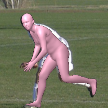

# Instruction for PyCAT4

Preview of demo results:



## Requirements

Tested on Ubuntu20.04

- Python 3.8
```
conda create --no-default-packages -n pymafx python=3.8
conda activate pymafx
```

### packages

- [PyTorch](https://www.pytorch.org) tested on version 1.9.0
```
conda install pytorch==1.9.0 torchvision==0.10.0 cudatoolkit=11.1 -c pytorch -c conda-forge
```

- [pytorch3d](https://github.com/facebookresearch/pytorch3d/blob/main/INSTALL.md)
```
pip install "git+https://github.com/facebookresearch/pytorch3d.git@stable"
```

- other packages listed in `requirements.txt`
```
pip install -r requirements.txt
```

### necessary files

> mesh_downsampling.npz & DensePose UV data

- Run the following script to fetch mesh_downsampling.npz & DensePose UV data from other repositories.

```
bash fetch_data.sh
```
> SMPL model files

- Collect SMPL model files from [https://smpl.is.tue.mpg.de](https://smpl.is.tue.mpg.de) and [UP](https://github.com/classner/up/blob/master/models/3D/basicModel_neutral_lbs_10_207_0_v1.0.0.pkl). Rename model files and put them into the `./data/smpl` directory.

> Fetch preprocessed data from [SPIN](https://github.com/nkolot/SPIN#fetch-data).

> Fetch final_fits data from [SPIN](https://github.com/nkolot/SPIN#final-fits). [important note: using [EFT](https://github.com/facebookresearch/eft) fits for training is much better. Compatible npz files are available [here](https://cloud.tsinghua.edu.cn/d/635c717375664cd6b3f5)]

> Download the [pre-trained model](https://drive.google.com/drive/folders/1R4_Vi4TpCQ26-6_b2PhjTBg-nBxZKjz6?usp=sharing) and swin_large_patch4_window12_384_22k.pth and resnet50-19c8e357.pth and put it into the `./data/pretrained_model` directory.

After collecting the above necessary files, the directory structure of `./data` is expected as follows.  
```
./data
├── dataset_extras
│   └── .npz files
├── J_regressor_extra.npy
├── J_regressor_h36m.npy
├── cube_parts.npy
├── dp_vert_pid.npy
├── vertex_texture.npy
├── mesh_downsampling.npz
├── pretrained_model
│   ├── PyMAF_model_checkpoint.pt
│   ├── swin_large_patch4_window12_384_22k.pth
│   └──resnet50-19c8e357.pth
├── smpl
│   ├── SMPL_FEMALE.pkl
│   ├── SMPL_MALE.pkl
│   └── SMPL_NEUTRAL.pkl
├── smpl_mean_params.npz
├── final_fits
│   └── .npy files
└── UV_data
    ├── UV_Processed.mat
    └── UV_symmetry_transforms.mat
```

## Demo

#### For image input:

```
python3 demo.py --checkpoint=/root/autodl-tmp/logs/pymaf_res50_mix/CA_FPN_Transformer4D/checkpoints/model_epoch_60.pt  --img_file examples/coco1-1.jpg
```
#### For video input:
```
python3 demo.py --checkpoint=/root/autodl-tmp/logs/pymaf_res50_mix/CA_FPN_Transformer4D/checkpoints/model_epoch_60.pt  --vid_file examples/flashmob-1.mp4
```

## Evaluation

Everytime that change model to use need to modify code in pymaf_net.py

```python
self.feature_extractor = get_resnet_encoder(cfg, global_mode=self.global_mode)

#self.feature_extractor = get_resnet_CA_encoder(cfg, global_mode=self.global_mode)

#self.feature_extractor = get_resnet_CA_FPN_encoder(cfg, global_mode=self.global_mode)

#self.feature_extractor = get_resnet_CA_FPN_Transformer_encoder(cfg, global_mode=self.global_mode)

#self.feature_extractor = get_resnet_CA_FPN_Transformer_4D_encoder(cfg, global_mode=self.global_mode)
```


### COCO Keypoint Localization

1. Download the preprocessed data [coco_2014_val.npz](https://drive.google.com/drive/folders/1R4_Vi4TpCQ26-6_b2PhjTBg-nBxZKjz6?usp=sharing). Put it into the `./data/dataset_extras` directory. 

2. Run the COCO evaluation code.
```
python3 eval_coco.py --checkpoint=/root/autodl-tmp/logs/pymaf_res50_mix/CA_FPN_Transformer4D/checkpoints/model_epoch_60.pt
```

```
#Evaluate Baseline
python3 eval_coco.py --checkpoint=/root/autodl-tmp/logs/baseline/checkpoints/model_epoch_50.pt

#Evaluate model with CA attention
python3 eval_coco.py --checkpoint=/root/autodl-tmp/logs/CA/checkpoints/model_epoch_60.pt

#Evaluate model with CA attention and Swin-transformer
python3 eval_coco.py --checkpoint=/root/autodl-tmp/logs/CA_FPN/checkpoints/model_epoch_60.pt

#Evaluate model with CA attention and Swin-transformer and multi-scale fusion
python3 eval_coco.py --checkpoint=/root/autodl-tmp/logs/CA_FPN_Transformer/checkpoints/model_epoch_50.pt

#Evaluate model with CA attention and Swin-transformer and multi-scale fusion and temporal fusion
python3 eval_coco.py --checkpoint=/root/autodl-tmp/logs/CA_FPN_Transformer_4D/checkpoints/model_epoch_50.pt
```


### 3DPW

Run the evaluation code. Using `--dataset` to specify the evaluation dataset.
```
python3 eval.py --checkpoint=/root/autodl-tmp/logs/pymaf_res50_mix/CA_FPN_Transformer4D/checkpoints/model_epoch_60.pt --dataset=3dpw --log_freq=20
```

```
#Evaluate Baseline
python3 eval.py --checkpoint=/root/autodl-tmp/logs/pymaf_res50_mix/baseline/checkpoints/model_epoch_60.pt --dataset=3dpw --log_freq=20

#Evaluate model with CA attention
python3 eval.py --checkpoint=/root/autodl-tmp/logs/pymaf_res50_mix/CA/checkpoints/model_epoch_60.pt --dataset=3dpw --log_freq=20

#Evaluate model with CA attention and Swin-transformer
python3 eval.py --checkpoint=/root/autodl-tmp/logs/pymaf_res50_mix/CA_FPN/checkpoints/model_epoch_50.pt --dataset=3dpw --log_freq=20

#Evaluate model with CA attention and Swin-transformer and multi-scale fusion
python3 eval.py --checkpoint=/root/autodl-tmp/logs/pymaf_res50_mix/CA_FPN_Transformer/checkpoints/model_epoch_50.pt --dataset=3dpw --log_freq=20

#Evaluate model with CA attention and Swin-transformer and multi-scale fusion and temporal fusion
python3 eval.py --checkpoint=/root/autodl-tmp/logs/pymaf_res50_mix/CA_FPN_Transformer4D/checkpoints/model_epoch_60.pt --dataset=3dpw --log_freq=20
```


## Training

PyCAT4 is trained on the mixture of COCO and 3DPW datasets. Example usage:
```
CUDA_VISIBLE_DEVICES=0 python3 train.py --regressor pymaf_net --misc TRAIN.BATCH_SIZE 32
```
We can monitor the training process by setting up a TensorBoard at the directory `./logs`.

## Realtime System

```
python3 realtime_test.py
```


## Acknowledgments

The code is developed upon the following projects. Many thanks to their contributions.

- [SPIN](https://github.com/nkolot/SPIN)

- [DaNet](https://github.com/HongwenZhang/DaNet-3DHumanReconstruction)

- [VIBE](https://github.com/mkocabas/VIBE)

- [PIFu](https://github.com/shunsukesaito/PIFu)

- [DensePose](https://github.com/facebookresearch/DensePose)

- [HMR](https://github.com/akanazawa/hmr)

- [pose_resnet](https://github.com/Microsoft/human-pose-estimation.pytorch)
